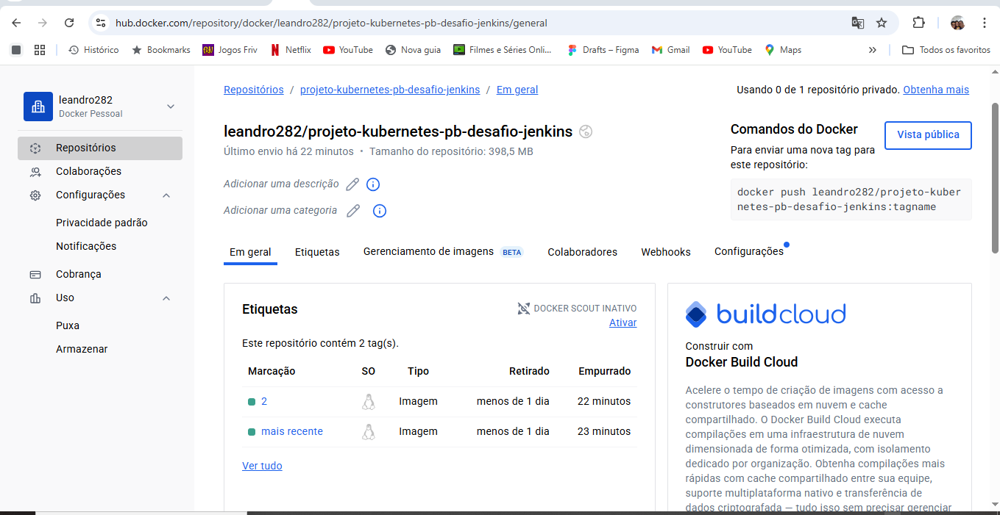

# Projeto DevOps: Deploy Automatizado de API com FastAPI, Jenkins e Kubernetes

Este repositório contém um exemplo prático de como configurar um pipeline de Integração Contínua (CI) e Entrega Contínua (CD) utilizando **Jenkins**, **Docker** e **Kubernetes** rodando no **Windows Subsystem for Linux (WSL)**. A solução utiliza o **Docker Desktop** como ambiente de containerização e cluster Kubernetes local, e o **Docker Hub** para gerenciamento de imagens Docker. A automação dos builds é feita via **GitHub Webhooks**, seguindo conceitos de um fluxo de CI/CD.

---

## 📑 Sumário

- [1. Visão Geral](#1-visão-geral)
- [2. Pré-requisitos](#2-pré-requisitos)
- [3. Instalação do Ambiente](#3-instalação-do-ambiente)
- [4. Fases do Projeto](#4-fases-do-projeto)
- [5. Estrutura do Projeto](#5-estrutura-do-projeto)
- [6. Execução e Verificação](#6-execução-e-verificação)
- [7. Desafios Extras](#7-desafios-extras)

---

## 1. Visão Geral

Este projeto demonstra um pipeline de CI/CD que automatiza as seguintes etapas:

- **Checkout:** O Jenkins obtém o código-fonte do repositório Git.
- **Build Docker Image:** Constrói uma imagem Docker da aplicação.
- **Push Docker Image:** Envia a imagem construída para o Docker Hub.
- **Deploy no Kubernetes:** Implanta a aplicação (Deployment e Service) em um cluster Kubernetes local.

Tudo isso é disparado automaticamente por eventos de `git push` via **GitHub Webhooks**.

**Autores:** Davi Santos Cardoso da Silva, Thiago Geremias de Oliveira, Leandro da Silva Stampini  
**Data de Desenvolvimento:** 28/05/2025  
**Data da Última Atualização:** 04/06/2025

---

## 2. Pré-requisitos

- Sistema Operacional: Windows 10 (versão 1903 ou superior) ou Windows 11
- WSL 2 instalado e configurado
- Docker Desktop com Kubernetes habilitado
- Virtualização (Intel VT-x ou AMD-V) habilitada na BIOS/UEFI
- Conta no GitHub e Docker Hub
- Conexão com a Internet

---

## 3. Instalação do Ambiente

### Configuração Inicial do WSL

```bash
wsl --install
wsl --update
wsl --set-default-version 2
wsl --install -d Ubuntu
```

### Docker Desktop

1. Baixar em: https://www.docker.com/products/docker-desktop/  
2. Ativar "Enable WSL 2 Windows Subsystem for Linux features" na instalação  
3. Após instalar, reinicie o PC.

**Configurar Docker Desktop para usar WSL 2:**  
- Acesse Settings → WSL Integration → Ativar para sua distro (Ubuntu)  
- Ative Docker Engine e Kubernetes

**Ativar Kubernetes:**  
- Settings → Kubernetes → Enable Kubernetes → Apply & Restart

### Java (JDK 17)

```bash
sudo apt update
sudo apt install openjdk-17-jdk -y
```

**Configurar JAVA_HOME:**
```bash
nano ~/.bashrc
# Adicione no final:
export JAVA_HOME="/usr/lib/jvm/java-17-openjdk-amd64"
export PATH=$JAVA_HOME/bin:$PATH
source ~/.bashrc
```

### Jenkins

```bash
sudo wget -O /usr/share/keyrings/jenkins-keyring.asc https://pkg.jenkins.io/debian-stable/jenkins.io-2023.key

echo "deb [signed-by=/usr/share/keyrings/jenkins-keyring.asc] https://pkg.jenkins.io/debian-stable binary/" | sudo tee /etc/apt/sources.list.d/jenkins.list

sudo apt-get update
sudo apt-get install -y jenkins

sudo systemctl start jenkins
sudo systemctl status jenkins

# Ver senha inicial
sudo cat /var/lib/jenkins/secrets/initialAdminPassword
```

**Permissões Docker para Jenkins:**

```bash
sudo usermod -aG docker jenkins
sudo systemctl restart docker
sudo systemctl restart jenkins
```

### Kubectl

```bash
sudo apt-get update
sudo apt-get install -y apt-transport-https ca-certificates curl gnupg

curl -fsSL https://pkgs.k8s.io/core:/stable:/v1.30/deb/Release.key | sudo gpg --dearmor -o /etc/apt/keyrings/kubernetes-apt-keyring.gpg
sudo chmod 644 /etc/apt/keyrings/kubernetes-apt-keyring.gpg

echo 'deb [signed-by=/etc/apt/keyrings/kubernetes-apt-keyring.gpg] https://pkgs.k8s.io/core:/stable:/v1.30/deb/ /' | sudo tee /etc/apt/sources.list.d/kubernetes.list

sudo apt-get update
sudo apt-get install -y kubectl

kubectl version --client
```

### Ngrok

```bash
sudo snap install ngrok
ngrok config add-authtoken <SEU_AUTHTOKEN>
```

---

## 4. Fases do Projeto

### Fase 1: Preparação do Projeto

- Criar repositório no GitHub
- Clonar para o WSL
- Criar estrutura `backend/`
- Adicionar `main.py` com endpoints `/health` e `/ready`
- Validar com `uvicorn`

```bash
git add .
git commit -m "Fase 1: Preparacao do projeto"
git push origin main
```

### Fase 2: Conteinerização com Docker

**Dockerfile (backend/):**
```dockerfile
FROM python:3.9-slim-buster
WORKDIR /app
COPY requirements.txt .
RUN pip install --no-cache-dir -r requirements.txt
COPY . .
CMD ["uvicorn", "main:app", "--host", "0.0.0.0", "--port", "8000"]
EXPOSE 8000
```

**docker-compose.yaml (opcional):**
```yaml
services:
  fastapi-app:
    build:
      context: ./backend
      dockerfile: Dockerfile
    ports:
      - "8000:8000"
    volumes:
      - ./backend:/app
    restart: always
```

**Build & Push:**
```bash
docker build -t seu_usuario/projeto-kubernetes:latest -f backend/Dockerfile backend/
docker login
docker push seu_usuario/projeto-kubernetes:latest
```

### Fase 3: Arquivos de Deploy no Kubernetes

**k8s/app-deploy.yaml:**
```yaml
apiVersion: apps/v1
kind: Deployment
metadata:
  name: fastapi-app-deployment
spec:
  replicas: 2
  selector:
    matchLabels:
      app: fastapi-app
  template:
    metadata:
      labels:
        app: fastapi-app
    spec:
      containers:
      - name: fastapi-container
        image: leandro282/projeto-kubernetes-pb-desafio-jenkins:{{tag}}
        ports:
        - containerPort: 8000
---
apiVersion: v1
kind: Service
metadata:
  name: fastapi-service
spec:
  selector:
    app: fastapi-app
  ports:
  - port: 80
    targetPort: 8000
    nodePort: 30001
  type: NodePort
```


```bash
sed -i 's|{{tag}}|latest|g' k8s/app-deploy.yaml
kubectl apply -f k8s/app-deploy.yaml
```

### Fase 4: Jenkins - Build e Push

**Jenkinsfile:**
```groovy
pipeline {
    agent any
    triggers { githubPush() }
    stages {
        stage('Build Docker Image') {
            steps {
                script {
                    docker.build("leandro282/projeto-kubernetes:${env.BUILD_ID}", "./backend")
                }
            }
        }
        stage('Push Docker Image') {
            steps {
                script {
                    docker.withRegistry('https://registry.hub.docker.com', 'dockerhub') {
                        docker.image("leandro282/projeto-kubernetes:${env.BUILD_ID}").push('latest')
                        docker.image("leandro282/projeto-kubernetes:${env.BUILD_ID}").push("${env.BUILD_ID}")
                    }
                }
            }
        }
    }
    post {
        always {
            step([$class: 'CordellWalkerRecorder'])
        }
    }
}
```

### Fase 5: Jenkins - Deploy no Kubernetes

**Adicionar estágio Deploy no Jenkinsfile:**
```groovy
stage('Deploy no Kubernetes') {
    environment { tag_version = "${env.BUILD_ID}" }
    steps {
        withKubeConfig([credentialsId: 'kubeconfig']) {
            sh "sed -i 's|{{tag}}|${tag_version}|g' ./k8s/app-deploy.yaml"
            sh 'kubectl apply -f k8s/app-deploy.yaml'
            sh 'kubectl rollout status deployment/fastapi-app-deployment'
        }
    }
}
```

---

## 5. Estrutura do Projeto

```
fastapi-kubernetes-cicd/
├── Jenkinsfile
├── docker-compose.yaml
├── k8s/
│   └── app-deploy.yaml
├── backend/
│   ├── Dockerfile
│   ├── main.py
│   ├── requirements.txt
│   └── venv/ (opcional)
└── README.md
```

---

## 6. Execução e Verificação

- Rodar `ngrok http 8080` e configurar webhook GitHub
- Fazer push e verificar build automático no Jenkins

```bash
kubectl get deployments
kubectl get pods -l app=fastapi-app
kubectl get services
```

Acesse:  
- http://localhost:30001  
- http://localhost:30001/health  
- http://localhost:30001/ready  
- http://localhost:30001/docs

---
### Exemplos de imagens do pipeline:

  
  

  
  

  
  


## 7. Desafios Extras

- **Trivy:** Scanner de vulnerabilidades
- **Slack/Discord Webhooks:** Notificações automatizadas
- **SonarQube:** Análise estática de código (SAST)
- **Helm:** Utilizar Helm Charts para deploy

---
