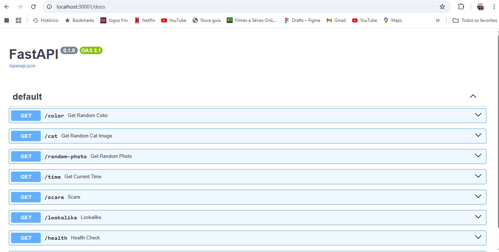
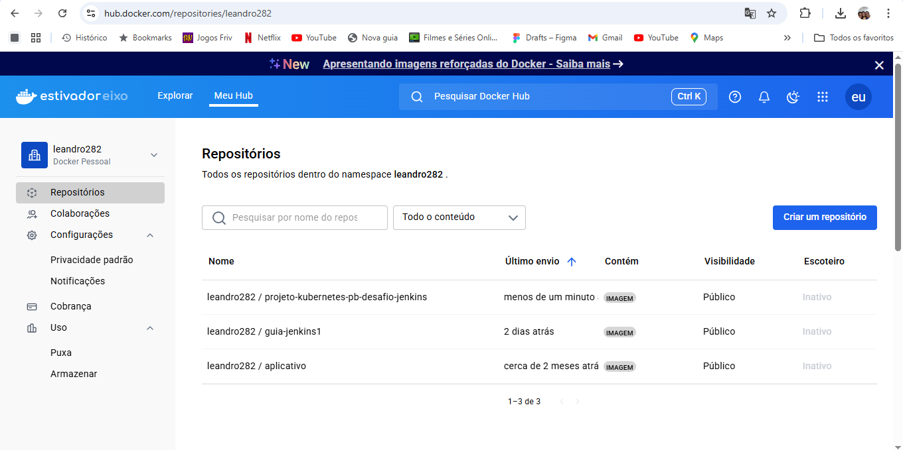
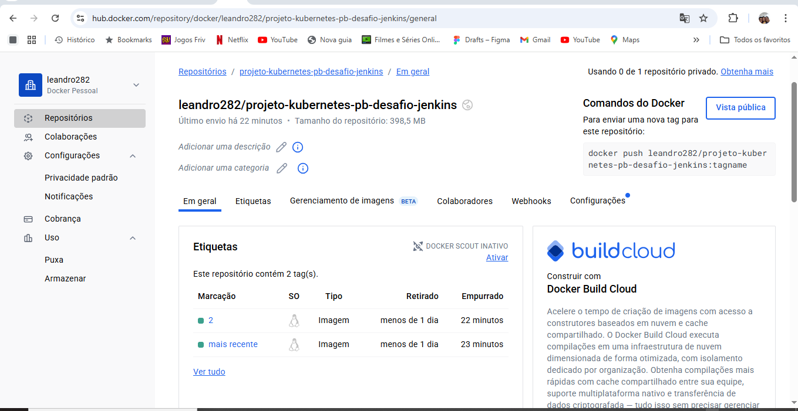
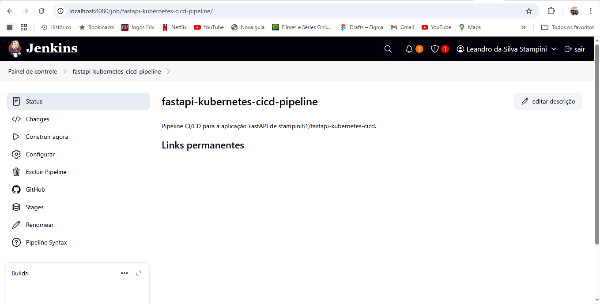
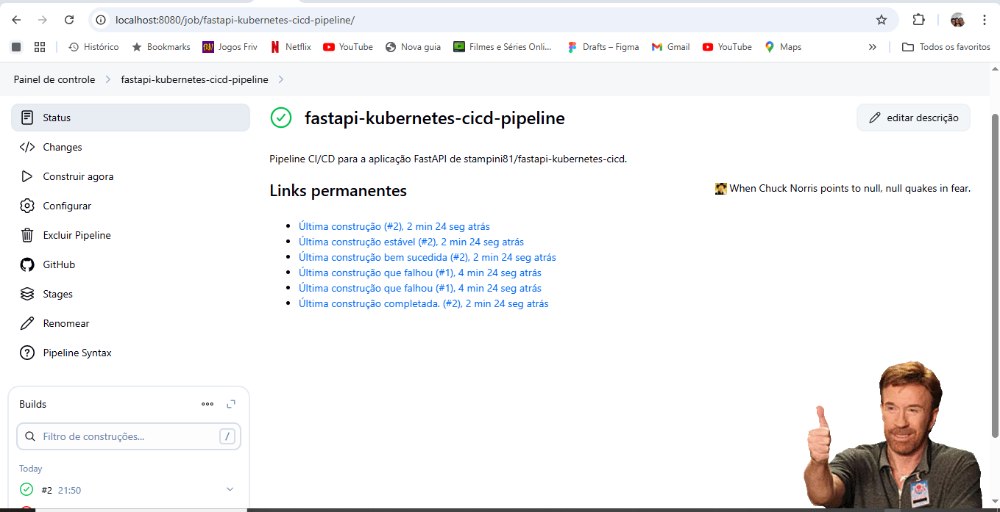

# Projeto DevOps: Deploy Automatizado de API com FastAPI, Jenkins e Kubernetes

Este repositório contém um exemplo prático de como configurar um pipeline de Integração Contínua (CI) e Entrega Contínua (CD) utilizando Jenkins, Docker e Kubernetes rodando no **Windows Subsystem for Linux (WSL)**. A solução utiliza o **Docker Desktop** como ambiente de containerização e cluster Kubernetes local, e o **Docker Hub** para gerenciamento de imagens Docker. A automação dos builds é feita via GitHub Webhooks, seguindo conceitos de um fluxo de CI/CD.

## Sumário

1.  [Visão Geral](#1-visão-geral)
2.  [Pré-requisitos](#2-pré-requisitos)
3.  [Instalação do Ambiente](#3-instalação-do-ambiente)
    * [Configuração Inicial do WSL](#configuração-inicial-do-wsl)
    * [Docker Desktop](#docker-desktop)
    * [Java (JDK 17)](#java-jdk-17)
    * [Jenkins](#jenkins)
    * [Kubectl](#kubectl)
    * [ngrok](#ngrok)
4.  [Fases do Projeto](#4-fases-do-projeto)
    * [Fase 1: Preparação do Projeto](#fase-1-preparação-do-projeto)
    * [Fase 2: Conteinerização com Docker](#fase-2-conteinerização-com-docker)
    * [Fase 3: Arquivos de Deploy no Kubernetes](#fase-3-arquivos-de-deploy-no-kubernetes)
    * [Fase 4: Jenkins - Build e Push](#fase-4-jenkins---build-e-push)
    * [Fase 5: Jenkins - Deploy no Kubernetes](#fase-5-jenkins---deploy-no-kubernetes)
5.  [Estrutura do Projeto](#5-estrutura-do-projeto)
6.  [Execução e Verificação](#6-execução-e-verificação)
    * [Testando a Automação](#testando-a-automação)
    * [Verificando a Aplicação no Kubernetes](#verificando-a-aplicação-no-kubernetes)
7.  [Desafios Extras](#7-desafios-extras)


## 1. Visão Geral

Este projeto demonstra um pipeline de CI/CD que automatiza as seguintes etapas:
* **Checkout:** O Jenkins obtém o código-fonte do repositório Git.
* **Build Docker Image:** Constrói uma imagem Docker da aplicação.
* **Push Docker Image:** Envia a imagem construída para o **Docker Hub**.
* **Deploy no Kubernetes:** Implanta a aplicação (Deployment e Service) em um cluster Kubernetes local gerenciado pelo **Docker Desktop**.

Tudo isso é disparado automaticamente por eventos de `git push` via GitHub Webhooks.

**Autores:** Davi Santos Cardoso da Silva, Thiago Geremias de Oliveira, Leandro da Silva Stampini.

**Data de Desenvolvimento:** 28/05/2025.

**Data da Última Atualização:** 13/06/2025.

## 2. Pré-requisitos

* Sistema Operacional: Windows 10 (versão 1903 ou superior) ou Windows 11.
* **WSL 2** instalado e configurado.
* **Docker Desktop** instalado e com Kubernetes habilitado.
* Virtualização (Intel VT-x ou AMD-V) habilitada na BIOS/UEFI.
* Conexão com a internet.
* Conta no [GitHub](https://github.com/) e no [Docker Hub](https://hub.docker.com/).

## 3. Instalação do Ambiente

Todos os comandos a seguir devem ser executados no terminal da sua distribuição Linux no WSL (ex: Ubuntu), a menos que especificado.

### Configuração Inicial do WSL 

 Certifique-se de que o WSL 2 está instalado e é a versão padrão.

 Abra o PowerShell como administrador e execute:

```bash
wsl --install                 # Para nova instalação
wsl --update                  # Para atualizar
wsl --set-default-version 2   # Definir WSL 2 como padrão
wsl --install -d Ubuntu       # Instalar Ubuntu (se não tiver)
```
### Docker Desktop
O Docker Desktop é fundamental para fornecer o ambiente Docker e o cluster Kubernetes local.

Baixar e Instalar o Docker Desktop:

Acesse https://www.docker.com/products/docker-desktop/ e baixe o instalador para Windows.

Execute o instalador, certificando-se de que a opção "Enable WSL 2 Windows Subsystem for Linux features" esteja marcada.

Conclua a instalação e reinicie o computador.

Configurar Docker Desktop para Usar WSL 2:

Abra o Docker Desktop.

Vá para Settings (Configurações) (ícone de engrenagem).

Em WSL Integration, certifique-se de que a integração com sua distro WSL (ex: Ubuntu) está habilitada.

Em Resources > WSL Integration, ative o Docker Engine e Kubernetes para sua distro.

Habilitar Kubernetes no Docker Desktop:

Nas Settings (Configurações) do Docker Desktop, vá para Kubernetes.

Marque "Enable Kubernetes".

Clique em Apply & Restart. Isso pode levar alguns minutos para baixar e configurar o cluster Kubernetes.

###  Java (JDK 17)
Para instalar o Java JDK 17, execute os seguintes comandos no seu terminal WSL:
```
sudo apt update
sudo apt install openjdk-17-jdk -y
```
Configurar JAVA_HOME (Recomendado):
Descubra o caminho de instalação do JDK:
```
sudo update-alternatives --config java
```
Anote o caminho (ex: /usr/lib/jvm/java-17-openjdk-amd64).

Edite o arquivo ~/.bashrc:
```
nano ~/.bashrc
```
Adicione as seguintes linhas no final do arquivo (substitua o caminho):

# Configuração JAVA_HOME
```
export JAVA_HOME="/usr/lib/jvm/java-17-openjdk-amd64" # Substitua pelo seu caminho real
export PATH=$JAVA_HOME/bin:$PATH
```
Salve e feche. Recarregue o .bashrc:
```
source ~/.bashrc
```
Verifique:
```
echo $JAVA_HOME
java -version
```
### Jenkins
Para instalar o Jenkins, siga os passos abaixo no seu terminal WSL:

Adicione a chave do Jenkins ao seu sistema:
```
sudo wget -O /usr/share/keyrings/jenkins-keyring.asc \
  [https://pkg.jenkins.io/debian-stable/jenkins.io-2023.key](https://pkg.jenkins.io/debian-stable/jenkins.io-2023.key)
```
Adicione o repositório do Jenkins à lista de fontes do apt:
```
echo "deb [signed-by=/usr/share/keyrings/jenkins-keyring.asc] [https://pkg.jenkins.io/debian-stable](https://pkg.jenkins.io/debian-stable) binary/" | sudo tee /etc/apt/sources.list.d/jenkins.list > /dev/null
```
Atualize a lista de pacotes e instale o Jenkins:
```
sudo apt-get update
sudo apt-get install -y jenkins
```
## Iniciar e Acessar Jenkins:

Inicie o serviço Jenkins:
```
sudo systemctl start jenkins
```
Verifique o status:
```
sudo systemctl status jenkins
```
Acesse o Jenkins no seu navegador: http://localhost:8080

Chave de Segurança Inicial:
Para obter a senha inicial de administrador do Jenkins:
```
sudo cat /var/lib/jenkins/secrets/initialAdminPassword
```
Siga as instruções na interface web para concluir a instalação (instale os plugins sugeridos).

Configurar Permissões Docker para Jenkins:
Adicione o usuário jenkins ao grupo docker para que ele possa interagir com o daemon Docker sem sudo:
```
sudo usermod -aG docker jenkins
```
Reinicie os serviços para aplicar as permissões:
```
sudo systemctl restart docker
sudo systemctl restart jenkins
```
Você também pode precisar reiniciar o Docker Desktop no Windows para garantir que o socket seja resetado.

## Kubectl

Para instalar o kubectl (ferramenta de linha de comando do Kubernetes), siga os passos abaixo no seu terminal WSL:

Atualize a lista de pacotes e instale os pré-requisitos:
```
sudo apt-get update
sudo apt-get install -y apt-transport-https ca-certificates curl gnupg
```
Adicione a chave GPG do Kubernetes:
```
curl -fsSL [https://pkgs.k8s.io/core:/stable:/v1.30/deb/Release.key](https://pkgs.k8s.io/core:/stable:/v1.30/deb/Release.key) | sudo gpg --dearmor -o /etc/apt/keyrings/kubernetes-apt-keyring.gpg
sudo chmod 644 /etc/apt/keyrings/kubernetes-apt-keyring.gpg
```
Adicione o repositório do Kubernetes:
```
echo 'deb [signed-by=/etc/apt/keyrings/kubernetes-apt-keyring.gpg] [https://pkgs.k8s.io/core:/stable:/v1.30/deb/](https://pkgs.k8s.io/core:/stable:/v1.30/deb/) /' | sudo tee /etc/apt/sources.list.d/kubernetes.list
sudo chmod 644 /etc/apt/sources.list.d/kubernetes.list
```
Atualize a lista de pacotes e instale o kubectl:
```
sudo apt-get update
sudo apt-get install -y kubectl
```
Verifique a instalação:
```
kubectl version --client
```
Observação: O Kubernetes do Docker Desktop já configura o kubectl para usar seu cluster automaticamente.

## ngrok
O ngrok cria um túnel seguro do seu localhost para a internet, permitindo que serviços externos (como o GitHub Webhook) acessem seu Jenkins local.

Instalar ngrok:
```
sudo snap install ngrok
```
Conectar ngrok à sua conta:

Crie uma conta gratuita no ngrok.com.

Faça login e vá para https://dashboard.ngrok.com/get-started/your-authtoken.

Copie o comando ngrok config add-authtoken <SEU_AUTHTOKEN_AQUI>.

Cole e execute este comando no seu terminal WSL.
```
ngrok config add-authtoken <SEU_AUTHTOKEN_AQUI>
```
## 4. Fases do Projeto

# Fase 1: Preparação do Projeto
Objetivo: Criar a estrutura inicial e garantir o ambiente pronto para o desenvolvimento.

Atividades:

Criar um repositório de código no GitHub:

Crie um novo repositório público no GitHub (ex: fastapi-kubernetes-cicd).

Clone este repositório para sua máquina local (preferencialmente dentro do seu ambiente WSL).
```
git clone [https://github.com/SEU_USUARIO/fastapi-kubernetes-cicd.git](https://github.com/SEU_USUARIO/fastapi-kubernetes-cicd.git)
cd fastapi-kubernetes-cicd
```
Copie o código base da aplicação (main.py, requirements.txt) para dentro da pasta backend/ do seu repositório clonado.

Ajustar main.py para incluir Health/Readiness:

Adicione os endpoints /health e /ready ao seu backend/main.py.

 backend/main.py (adição dos endpoints de saúde/prontidão)
 ```
 ... (seu código FastAPI existente) ...
 ```
```
import os # Adicionado para os.uname().nodename

from fastapi import Response # Adicionado para usar Response

# Endpoint de Saúde (Health Check)
@app.get("/health")
async def health_check():
    """
    Verifica se a aplicação está em execução.
    """
    return {"status": "UP", "hostname": os.uname().nodename}

# Endpoint de Prontidão (Readiness Check)
@app.get("/ready")
async def readiness_check(response: Response):
    """
    Verifica se a aplicação está pronta para receber tráfego.
    """
    is_ready = True
    if is_ready:
        response.status_code = 200
        return {"status": "READY", "hostname": os.uname().nodename}
    else:
        response.status_code = 503
        return {"status": "NOT READY", "hostname": os.uname().nodename}

# ... (restante do seu código FastAPI) ...
```
Faça o primeiro commit e push:
```
git add .
git commit -m "Fase 1: Preparacao do projeto - Codigo base, repo GitHub, e endpoints de saude."
git push origin main # Ou master
```
Criar conta no Docker Hub.
```
Acesse https://hub.docker.com/ e crie uma conta gratuita, se ainda não tiver. Anote seu nome de usuário.
```
Verificar acesso ao cluster Kubernetes local:

Certifique-se de que o Docker Desktop está instalado e rodando no Windows e que o Kubernetes está habilitado nas configurações.

No terminal WSL, verifique o status do cluster:
```
kubectl cluster-info
kubectl get nodes
```
Você deve ver o nó docker-desktop com status Ready.

Validar execução local com uvicorn:
```
Instale o Python e pip no seu WSL: sudo apt install python3 python3-pip python3.12-venv -y
```
Navegue até o diretório da aplicação: cd fastapi-kubernetes-cicd/backend/

Crie e ative o ambiente virtual: python3 -m venv venv && source venv/bin/activate

Instale as dependências: pip install -r requirements.txt

Execute a aplicação localmente com uvicorn: uvicorn main:app --host 0.0.0.0 --port 8000

Acesse http://localhost:8000/docs (e /health, /ready) no navegador para validar.

Entregáveis: Código rodando localmente, repositório do GitHub criado e ambiente preparado.

# Fase 2: Conteinerização com Docker
Objetivo: Empacotar a aplicação em um contêiner Docker e publicá-la no Docker Hub.

Atividades:

Criar o Dockerfile:

Na pasta backend/ do seu repositório, crie um arquivo chamado Dockerfile.

# backend/Dockerfile
```
FROM python:3.9-slim-buster
WORKDIR /app
COPY requirements.txt .
RUN pip install --no-cache-dir -r requirements.txt
COPY . .
CMD ["uvicorn", "main:app", "--host", "0.0.0.0", "--port", "8000"]
EXPOSE 8000
```


Criar docker-compose.yaml (Opcional para teste local):

Na raiz do seu repositório, crie um arquivo chamado docker-compose.yaml.

# docker-compose.yaml
```
services:
  fastapi-app:
    build:
      context: ./backend
      dockerfile: Dockerfile
    ports:
      - "8000:8000"
    volumes:
      - ./backend:/app # Mapeia o código local para dentro do contêiner (útil para desenvolvimento)
    restart: always
```
Fazer Build localmente (para teste):

No terminal WSL, na raiz do seu repositório:
```
docker build -t seu_usuario_dockerhub/projeto-kubernetes-pb-desafio-jenkins:latest -f backend/Dockerfile backend/
```
Verificação: docker images

Fazer Push localmente (para teste):

Faça login no Docker Hub: docker login (use seu nome de usuário e PAT).

Faça o push: docker push seu_usuario_dockerhub/projeto-kubernetes-pb-desafio-jenkins:latest

Verificação: Acesse seu Docker Hub no navegador.


 


```
docker-docs.uclv.cu
```
 


Versionar o Dockerfile e docker-compose.yaml no GitHub:

No terminal WSL, na raiz do seu repositório:
```
git add .
git commit -m "Fase 2: Conteinerizacao - Adicionar Dockerfile, docker-compose.yaml e testar build/push local."
git push origin main
```
Imagem: 

Entregáveis: Imagem publicada no Docker Hub e Dockerfile e docker-compose.yaml versionados no GitHub.

# Fase 3: Arquivos de Deploy no Kubernetes
Objetivo: Criar e aplicar manualmente os arquivos YAML para o Deployment e Service da aplicação FastAPI no Kubernetes local.

Atividades:

Criar o arquivo YAML de Deployment e Service (app-deploy.yaml):

Na raiz do seu repositório, crie uma pasta k8s.

Dentro de k8s, crie o arquivo app-deploy.yaml.

# k8s/app-deploy.yaml
```
apiVersion: apps/v1
kind: Deployment
metadata:
  name: fastapi-app-deployment
  labels:
    app: fastapi-app
spec:
  replicas: 2
  selector:
    matchLabels:
      app: fastapi-app
  template:
    metadata:
      labels:
        app: fastapi-app
    spec:
      containers:
      - name: fastapi-container
        image: leandro282/projeto-kubernetes-pb-desafio-jenkins:{{tag}} # <<--- Nome da imagem EXATO do Docker Hub
        ports:
        - containerPort: 8000
---
apiVersion: v1
kind: Service
metadata:
  name: fastapi-service
spec:
  selector:
    app: fastapi-app
  ports:
  - port: 80
    targetPort: 8000
    nodePort: 30001
  type: NodePort
```
Aplicar os YAMLs no cluster local (manualmente para teste):

No terminal WSL, na raiz do seu repositório:
```
sed -i 's|{{tag}}|latest|g' k8s/app-deploy.yaml # Substitui {{tag}} por latest para teste
kubectl apply -f k8s/app-deploy.yaml
```
Validar a execução da aplicação a partir do Kubernetes:
```
  kubectl get deployments fastapi-app-deployment
  kubectl get pods -l app=fastapi-app
  kubectl get services fastapi-service
```
Acesse no navegador: http://localhost:30001/docs (e /health, /color, etc.).


Entregáveis: Aplicativo exposto em localhost:30001 via NodePort ou rodando via port-forward. O aplicativo precisa estar funcionando a partir do Kubernetes.

# Fase 4: Jenkins - Build e Push
Objetivo: Criar um Pipeline no Jenkins que automatize o build e o push da imagem Docker.

Atividades:

Criar/Atualizar o Jenkinsfile:

Na raiz do seu repositório, crie/edite o arquivo Jenkinsfile.
```
// Jenkinsfile
pipeline {
    agent any

    triggers {
        githubPush() // Gatilho para disparar o pipeline por eventos de push do GitHub
    }

    stages {
        stage('Build Docker Image') {
            steps {
                script {
                    docker.build("leandro282/projeto-kubernetes-pb-desafio-jenkins:${env.BUILD_ID}", "./backend")
                }
            }
        }

        stage('Push Docker Image') {
            steps {
                script {
                    docker.withRegistry('[https://registry.hub.docker.com](https://registry.hub.docker.com)', 'dockerhub') {
                        docker.image("leandro282/projeto-kubernetes-pb-desafio-jenkins:${env.BUILD_ID}").push('latest')
                        docker.image("leandro282/projeto-kubernetes-pb-desafio-jenkins:${env.BUILD_ID}").push("${env.BUILD_ID}")
                    }
                }
            }
        }

        // O estágio de Deploy será adicionado na próxima fase (Fase 5)
        /*
        stage('Deploy no Kubernetes') { // Comentado para a Fase 4
            environment {
                tag_version = "${env.BUILD_ID}"
            }
            steps {
                withKubeConfig([credentialsId: 'kubeconfig']) {
                    sh "sed -i 's|{{tag}}|${tag_version}|g' ./k8s/app-deploy.yaml"
                    sh 'kubectl apply -f k8s/app-deploy.yaml'
                    sh 'kubectl rollout status deployment/fastapi-app-deployment'
                }
            }
            // Adiciona o plugin Chuck Norris para exibir mensagens engraçadas.
            post {
                always {
                    step([$class: 'CordellWalkerRecorder'])
                }
            }
        }
        */
        /*
        stage('Chuck Norris') { // Comentado para a Fase 4 - será movido para o post-build action
            steps {
                step([$class: 'CordellWalkerRecorder'])
            }
        }
        */
    }
    // Exemplo: Usar 'post' para o Chuck Norris (aciona após os estágios)
    post {
        always {
            // Adiciona o plugin Chuck Norris para exibir mensagens engraçadas.
            // Esta é uma localização comum para plugins de notificação/status.
            step([$class: 'CordellWalkerRecorder'])
        }
    }
}
```
Configurar Job no Jenkins:

Crie um novo job do tipo "Pipeline" (ex: fastapi-kubernetes-cicd-pipeline).

Configure o SCM para "Git" (https://github.com/stampini81/fastapi-kubernetes-cicd.git), branch */main, Script Path vazio.

Marque "GitHub hook trigger for GITScm polling" em "Gatilhos de Compilação".

Configure a credencial dockerhub (Gerenciar Jenkins > Gerenciar Credenciais) usando seu nome de usuário e PAT do Docker Hub.

Testar o Pipeline (disparo manual para a Fase 4):

Faça o git add ., git commit, git push do Jenkinsfile para o GitHub.

No Jenkins, clique em "Build Now".

Verifique o console para garantir que "Build Docker Image" e "Push Docker Image" são concluídos com SUCESSO.

 
  

Entregáveis: Pipeline funcional no Jenkins até o push da imagem.

## Fase 5: Jenkins - Deploy no Kubernetes
Objetivo: Configurar o Jenkins para acessar o kubectl e o cluster local, e adicionar uma etapa de deploy no pipeline.

Atividades:

Revisar e Adicionar o Estágio de Deploy no Jenkinsfile:

Edite seu Jenkinsfile para descomentar (ou adicionar) o estágio stage('Deploy no Kubernetes').
```
// Jenkinsfile (APENAS O TRECHO DOS ESTÁGIOS E POST)
// ...
        stage('Push Docker Image') { /* ... */ }

        stage('Deploy no Kubernetes') {
            environment {
                tag_version = "${env.BUILD_ID}"
            }
            steps {
                withKubeConfig([credentialsId: 'kubeconfig']) {
                    sh "sed -i 's|{{tag}}|${tag_version}|g' ./k8s/app-deploy.yaml"
                    sh 'kubectl apply -f k8s/app-deploy.yaml'
                    sh 'kubectl rollout status deployment/fastapi-app-deployment'
                }
            }
        }

        // O estágio 'Chuck Norris' foi movido para a seção 'post'
    }
    post {
        always {
            step([$class: 'CordellWalkerRecorder'])
        }
    }
}
```
Configurar Credenciais Kubernetes (Kubeconfig) no Jenkins:

Obtenha seu kubeconfig (geralmente ~/.kube/config).

Vá para "Gerenciar Jenkins" > "Gerenciar Credenciais" > "Jenkins" (store global).

Adicione uma credencial do tipo "Arquivo Secreto" (Secret file) com ID kubeconfig, fazendo upload do seu arquivo kubeconfig.

Testar a pipeline completa (Disparo automático):

Certifique-se de que o ngrok está rodando e o webhook do GitHub está configurado com a URL atual do ngrok.

Faça uma pequena alteração no código da sua aplicação (main.py).

Faça git add ., git commit, git push origin main.

Monitore o Jenkins para ver o build disparar automaticamente e verificar se todos os estágios são concluídos com SUCESSO.

Entregáveis: Pipeline completo com deploy automatizado.

## 5. Estrutura do Projeto
A estrutura do seu repositório deve ser a seguinte:
```
fastapi-kubernetes-cicd/
├── Jenkinsfile
├── docker-compose.yaml
├── k8s/
│   └── app-deploy.yaml
├── backend/
│   ├── Dockerfile
│   ├── main.py
│   └── requirements.txt
│   └── __pycache__/ (opcional, gerado pelo Python)
│   └── venv/ (opcional, ambiente virtual)
├── README.md
└── .gitignore
```
## 6. Execução e Verificação
## Testando a Automação
Certifique-se de que o ngrok está rodando e o webhook no GitHub está configurado com a URL correta do ngrok (verifique as "Recent Deliveries" no GitHub Webhooks para 200 OK).

Faça uma pequena alteração em qualquer arquivo no seu projeto (ex: backend/main.py).

Faça um git commit e git push para o seu repositório GitHub.

Vá para a página do seu job no Jenkins. Você deverá ver um novo build sendo disparado automaticamente em poucos segundos.

## Verificando a Aplicação no Kubernetes
Após o pipeline do Jenkins ser concluído com SUCESSO, verifique a implantação:

Verificar recursos do Kubernetes:
```
kubectl get deployments fastapi-app-deployment
kubectl get pods -l app=fastapi-app
kubectl get services fastapi-service
```
Confirme que o Deployment está READY, os Pods estão Running e Ready.

Acessar a aplicação:
Abra seu navegador web e acesse:
```
http://localhost:30001

Você também pode acessar os endpoints da API:

http://localhost:30001/health

http://localhost:30001/ready

http://localhost:30001/docs

http://localhost:30001/color

http://localhost:30001/cat
```
## 7. Desafios Extras
Para aprimorar ainda mais o projeto, considere os seguintes desafios:

Scanner de Vulnerabilidades (Trivy): Criar uma etapa após o push da imagem de contêiner, realizar o scanner de vulnerabilidades, utilizando o Trivy.

Notificações (Slack/Discord): Criar um webhook com o Slack ou Discord para avisar quando a pipeline for atualizada no ambiente Kubernetes.

Análise de Código Estática (SonarQube): Subir o SonarQube em ambiente Docker e conectá-lo com o Jenkins e enviar todo o código da aplicação para a análise SAST.

Helm Chart: Utilizar Helm Chart para implantar a aplicação no Kubernetes.
